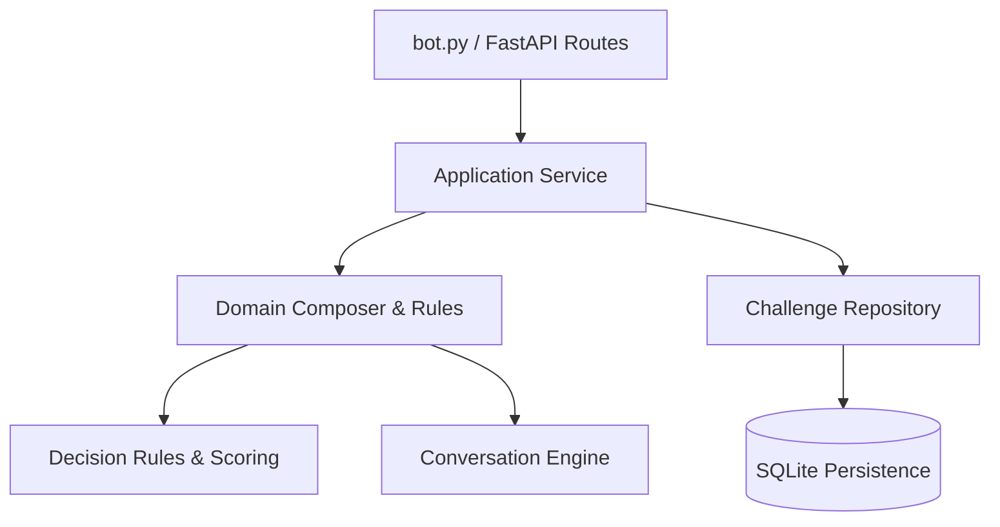

# magicpin Vera AI Challenge — Merchant AI Assistant

Deterministic FastAPI service & Python module for the magicpin Vera AI Challenge. The system ingests versioned merchant, category, customer, and trigger contexts, stores them durably, and produces explainable, highly grounded WhatsApp messages through a deterministic `compose(category, merchant, trigger, customer?)` engine.

## Challenge Deliverables

- `bot.py`: Main entrypoint module implementing `compose(category, merchant, trigger, customer=None) -> dict` as required by Section 7.1 of `challenge-brief.md`.
- `submission.jsonl`: 30 pre-composed benchmark outputs for the official challenge test pairs.
- `app/`: Production-ready FastAPI web service exposing `/v1/context`, `/v1/tick`, `/v1/reply`, `/v1/healthz`, and `/v1/metadata`.
- `magicpin-ai-challenge/`: Complete challenge brief, test harness, dataset tools, and `judge_simulator.py`.

## Architecture & Design



### Core Principles & Scoring Strategy
1. **High Specificity**: Grounded on concrete, verifiable facts (trial sizes, JIDA/DCI citations, metric deltas, exact prices, preferred slots).
2. **Category Fit**: Adheres strictly to vertical tone (clinical peer voice for dentists using `Dr.` prefix, warm/practical tone for salons, operator-to-operator tone for restaurants).
3. **Merchant Personalization**: Uses exact merchant/owner names, active catalog offers, and locality without hallucination.
4. **Trigger Relevance**: Explains *why now* based on the trigger payload (digest release, perf dip, IPL match, renewal window, customer recall).
5. **Auto-Reply & Opt-out Handling**: Immediately detects auto-reply loops and hostile opt-outs, gracefully terminating conversations (`action="end"`) to prevent message pollution.
6. **Intent Handoff**: Instantly transitions from qualification mode to action execution (`action="send"`) when the merchant signals commitment (`"yes"`, `"let's do it"`, `"what's next"`).

## Local Setup & Usage

### 1. Python Environment Setup
```bash
python -m venv .venv
# On Windows PowerShell:
.\.venv\Scripts\Activate.ps1
# On Linux/macOS:
source .venv/bin/activate

pip install -r requirements.txt
```

### 2. Standalone Module (`bot.py`) Usage
```python
from bot import compose

category_ctx = {"slug": "dentists", "name": "Dentists", ...}
merchant_ctx = {"merchant_id": "m_001", "identity": {"name": "Dr. Meera's Dental Clinic"}, ...}
trigger_ctx = {"id": "trg_001", "kind": "research_digest", ...}

result = compose(category_ctx, merchant_ctx, trigger_ctx)
print(result["body"])
# Output: "Dr. Meera's Dental Clinic, JIDA Oct 2026, p.14 landed..."
```

### 3. Running the FastAPI Web Service
```bash
uvicorn app.main:app --host 0.0.0.0 --port 8080
```
Or directly:
```bash
python -m app
```

### 4. Running Pytest Suite
```bash
python -m pytest
```

### 5. Running the Judge Harness
```bash
python magicpin-ai-challenge/judge_simulator.py
```

